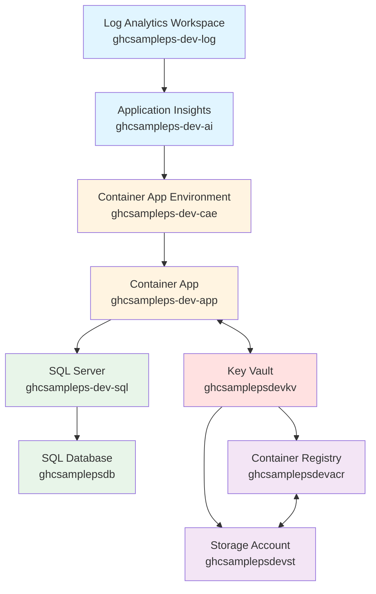

# Resource Group: rg-ghcsampleps-dev

**Location:** Canada Central  
**Status:** Succeeded  
**Last Updated:** December 11, 2025

## Overview

This resource group contains a complete application infrastructure stack for the development environment, including containerized applications, databases, storage, monitoring, and security services.

---

## Resources

### 1. Container App Environment

**Name:** `ghcsampleps-dev-cae`  
**Type:** Microsoft.App/managedEnvironments  
**Location:** Canada Central  
**Status:** Succeeded  
**Created:** 2025-12-10 21:33:25 UTC  
**Last Modified:** 2025-12-10 21:44:15 UTC

Container Apps managed environment that provides the hosting infrastructure for containerized applications.

---

### 2. Log Analytics Workspace

**Name:** `ghcsampleps-dev-log`  
**Type:** Microsoft.OperationalInsights/workspaces  
**Location:** Canada Central  
**Status:** Succeeded  
**Created:** 2025-12-10 21:29:47 UTC  
**Last Modified:** 2025-12-11 14:05:07 UTC  
**Tags:**

- `environment: dev`

Centralized logging and analytics workspace for monitoring and diagnostics across all services.

---

### 3. Container Registry

**Name:** `ghcsamplepsdevacr`  
**Type:** Microsoft.ContainerRegistry/registries  
**Location:** Canada Central  
**Status:** Succeeded  
**SKU:** Basic  
**Created:** 2025-12-10 21:29:47 UTC  
**Last Modified:** 2025-12-11 14:04:48 UTC  
**Tags:**

- `environment: dev`

Azure Container Registry for storing and managing container images used by the application.

---

### 4. Key Vault

**Name:** `ghcsamplepsdevkv`  
**Type:** Microsoft.KeyVault/vaults  
**Location:** Canada Central  
**Status:** Succeeded  
**Created:** 2025-12-10 21:29:48 UTC  
**Last Modified:** 2025-12-11 06:01:07 UTC  
**Tags:**

- `environment: dev`

Secure vault for managing secrets, certificates, and cryptographic keys used by the application.

---

### 5. SQL Server

**Name:** `ghcsampleps-dev-sql`  
**Type:** Microsoft.Sql/servers  
**Version:** v12.0  
**Location:** Canada Central  
**Status:** Succeeded  
**Created:** 2025-12-10 21:29:48 UTC  
**Last Modified:** 2025-12-11 14:05:16 UTC  
**Identity:** System-assigned managed identity enabled  
**Tags:**

- `environment: dev`

**Identity Details:**

- Principal ID: `49af4070-3fd9-4987-9c1d-0fa35869e1a9`
- Tenant ID: `66d8e3ac-39f0-4505-b4d8-2d91327ff764`

Azure SQL Database server hosting application databases.

#### 5.1 SQL Database - ghcsamplepsdb

**Name:** `ghcsamplepsdb`  
**Type:** Microsoft.Sql/servers/databases  
**Location:** Canada Central  
**Status:** Succeeded  
**SKU:** GP_S_Gen5 (General Purpose Serverless, Gen5, 2 vCores)  
**Kind:** v12.0, user, vcore, serverless  
**Created:** 2025-12-10 21:32:18 UTC  
**Last Modified:** 2025-12-11 14:05:32 UTC  
**Tags:**

- `environment: dev`

Application database running in serverless tier for cost optimization.

#### 5.2 SQL Database - master

**Name:** `master`  
**Type:** Microsoft.Sql/servers/databases  
**Location:** Canada Central  
**Status:** Succeeded  
**SKU:** GP_SYSTEM (System, 4 vCores)  
**Kind:** v12.0, system, serverless  
**Created:** 2025-12-10 21:32:36 UTC  
**Last Modified:** 2025-12-10 23:16:16 UTC

System database (master) managed by Azure SQL Server.

---

### 6. Storage Account

**Name:** `ghcsamplepsdevst`  
**Type:** Microsoft.Storage/storageAccounts  
**Kind:** StorageV2  
**Location:** Canada Central  
**Status:** Succeeded  
**SKU:** Standard_LRS (Locally Redundant Storage)  
**Created:** 2025-12-10 21:29:48 UTC  
**Last Modified:** 2025-12-11 14:04:48 UTC  
**Tags:**

- `environment: dev`

General-purpose v2 storage account for application data, logs, and backups.

---

### 7. Application Insights

**Name:** `ghcsampleps-dev-ai`  
**Type:** Microsoft.Insights/components  
**Kind:** web  
**Location:** Canada Central  
**Status:** Succeeded  
**Created:** 2025-12-10 21:30:08 UTC  
**Last Modified:** 2025-12-10 21:40:09 UTC  
**Tags:**

- `environment: dev`

Application performance monitoring and analytics for the web application.

---

### 8. Container App

**Name:** `ghcsampleps-dev-app`  
**Type:** Microsoft.App/containerApps  
**Location:** Canada Central  
**Status:** Succeeded  
**Created:** 2025-12-10 21:34:15 UTC  
**Last Modified:** 2025-12-11 15:28:34 UTC  
**Identity:** System-assigned managed identity enabled

**Identity Details:**

- Principal ID: `14474a26-d931-47c9-b0b0-1d41e197156e`
- Tenant ID: `66d8e3ac-39f0-4505-b4d8-2d91327ff764`

**System Data:**

- Created By: Application (283c6ecd-abe2-439d-b944-920ca1884f65)
- Last Modified By: User (covoricardo@MngEnvMCAP091123.onmicrosoft.com)
- Last Modified At: 2025-12-11 15:18:16 UTC

The main containerized application running in Azure Container Apps.

---

### 9. Action Group

**Name:** `Application Insights Smart Detection`  
**Type:** microsoft.insights/actiongroups  
**Location:** Global  
**Status:** Succeeded  
**Created:** 2025-12-10 21:40:10 UTC  
**Last Modified:** 2025-12-10 21:50:11 UTC

Action group for Application Insights Smart Detection alerts and notifications.

---

## Architecture Summary

This environment represents a modern, cloud-native application stack with:

### Compute & Hosting

- **Azure Container Apps** for serverless container hosting
- **Container Apps Environment** for managed infrastructure

### Data & Storage

- **Azure SQL Database** (Serverless tier) for relational data
- **Storage Account** (Standard LRS) for blob, file, and table storage

### DevOps & Registry

- **Azure Container Registry** (Basic tier) for container image management

### Security

- **Key Vault** for secrets and certificate management
- **Managed Identities** on SQL Server and Container App

### Monitoring & Observability

- **Log Analytics Workspace** for centralized logging
- **Application Insights** for APM and diagnostics
- **Action Groups** for alerting

### Cost Optimization Features

- Serverless SQL Database for automatic scaling
- Basic tier Container Registry for development workloads
- Standard LRS storage for cost-effective redundancy

---

## Resource Dependencies

---

## Notes

- All resources are tagged with `environment: dev` (except system resources)
- Two resources have system-assigned managed identities enabled (SQL Server and Container App)
- Container App was last modified by user `covoricardo@MngEnvMCAP091123.onmicrosoft.com`
- All resources are deployed in the Canada Central region for data residency and low latency
